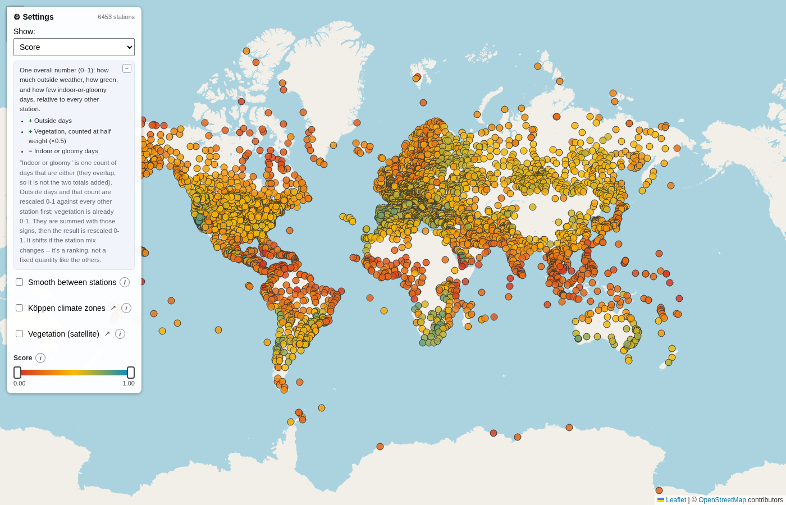

# Climate Analysis

**<a href="https://fakult.net/weather2" target="_blank" rel="noopener">fakult.net/weather2</a>**

An interactive map of ~6,500 weather stations worldwide, scored on how pleasant
the weather actually is to be outside in, computed directly from 16 years of
raw NOAA hourly weather observations (no third-party climate APIs).



## What it shows

Each station gets a handful of metrics, all computed the same way everywhere so
they're comparable station to station:

- **Score** -- one overall number, combining the metrics below relative to every
  other station.
- **Outside days / Indoor days / Gloomy days** -- per year. An "outside day" has
  a run of good outdoor weather (comfortable temperature, dew point, low rain
  and cloud); an "indoor day" is genuinely unpleasant outside (extreme heat or
  cold, muggy, windy, or overcast-and-wet); a "gloomy day" is just heavily
  overcast, independent of the others.
- **Outside / indoor streaks** -- runs of 3+ such days in a row, since a string
  of great days (or miserable ones) matters more than the same days scattered
  through the year.
- **Vegetation** -- how green the land around the station is, from satellite
  data, with credit for a real growing season rather than one lush month.
- **Seasonal concentration** -- whether the good weather is spread through the
  year or concentrated in one season.

Click a station for the numbers; "Data details" breaks a station down year by
year and shows a typical year's monthly pattern.

Two optional map overlays: [Köppen climate
classification](https://en.wikipedia.org/wiki/K%C3%B6ppen_climate_classification)
and the same satellite vegetation data behind the Vegetation metric.

## The data

Everything is computed from [NOAA's Integrated Surface Database
(ISD)](https://www.ncei.noaa.gov/products/land-based-station/integrated-surface-database)
-- raw hourly weather station observations, publicly mirrored on S3, 2010-2025.
Station metadata (name, location, country) comes from NOAA's `isd-history.csv`.
Vegetation greenness comes from a public satellite NDVI dataset
(`compute/tools/build_ndvi_grid.py`); Köppen zones from Beck et al. 2018
(`compute/tools/build_koppen_grid.py`).

None of the raw or intermediate data is in this repo (it's well over 100 GB) --
`compute/` is the pipeline that builds `data/` from scratch.

## Installation

What's actually needed, and why:

- **Python 3** -- the pipeline itself is stdlib only; nothing to install.
- **A C compiler (`cc`)** on `PATH` -- the parser and scorer are small C
  libraries, built automatically (with `cc -shared -fPIC`) the first time you
  run the pipeline. There's no Python fallback, so this one's required.
- **The AWS CLI (`aws`)** on `PATH` -- only for `pull_isd_data.sh`. No AWS
  account needed; the bucket is public (`--no-sign-request`).
- **Pillow and numpy** -- only for the two one-time data-prep scripts,
  `compute/tools/build_ndvi_grid.py` and `build_koppen_grid.py`. Not needed
  for the main pipeline or the site itself.
- **Disk space and internet access** -- the raw ISD download is roughly
  160 GB (see `pull_isd_data.sh`); the compute pipeline's own cache adds some
  more. The map page loads Leaflet and topojson from a CDN, so it needs
  internet access even when served locally.

### Ubuntu / Debian

```bash
sudo apt update
sudo apt install -y python3 build-essential awscli python3-pil python3-numpy
```

That's everything above in one line -- `python3-pil` and `python3-numpy` are
Ubuntu's Pillow/numpy packages, so there's no `pip` needed at all.

### macOS

```bash
xcode-select --install              # C compiler (Command Line Tools)
brew install awscli python3
python3 -m pip install --break-system-packages pillow numpy
```

(Homebrew's Python, like recent Ubuntu, blocks a plain `pip install` outside
a virtual environment -- use a `venv` instead of `--break-system-packages`
if you'd rather not touch the system Python.)

### Other Linux distros

The same four pieces, via your package manager: a C toolchain (`gcc` or
`clang`), the AWS CLI (`pip install awscli` if your distro doesn't package
it), and Pillow/numpy (`python3-pillow`/`python3-numpy` on Fedora, for
example, or `pip install pillow numpy`).

### Windows

Not supported directly -- the build step compiles with Unix-style flags
(`-shared -fPIC`). Use [WSL2](https://learn.microsoft.com/windows/wsl/install)
with an Ubuntu image and follow the Ubuntu instructions above.

## Compute pipeline

```
compute/pull_isd_data.sh             # download raw ISD data (one-time, slow, ~160 GB)
compute/tools/build_ndvi_grid.py     # download + build the vegetation grid (one-time)
compute/tools/build_koppen_grid.py   # download + build the Köppen climate grid (one-time)
compute/0_run_all.py                 # run every step below in order
```

| Step | What it does |
|---|---|
| 1. Build station index | lists every station-year file that was downloaded |
| 2. Filter stations | keeps stations that report often enough to be scored (roughly 3-hourly or better) |
| 3. Parse | reads each station-year's raw hourly reports into a compact typed format |
| 4. Derive | scores each year (day/night aware, using the station's own latitude and local solar time), then averages across years |
| 5. Build output | joins in station names/countries and writes the JSON the map loads (`data/`) |

Each step caches its own output and only redoes the work that's actually
stale, so re-running after a small change (a tweaked threshold, a new metric)
is fast -- it doesn't re-touch the raw data. See `compute/README.md` for the
full layout, and `compute/PARSER_ACCELERATION.md` for why the hot paths are C.

## Running it locally

```
cd compute && python3 0_run_all.py
cd .. && python3 -m http.server
```

Then open `http://localhost:8000`.
